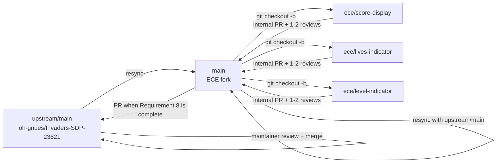

# Git Workflow – Team ECE (Requirement 8: Gameplay HUD)

**Project:** CSE2024 Software Development Practices – Space Invaders (10 teams)
**Main repository:** `oh-gnues/Invaders-SDP-23621`
**Team fork:** `Rochdgrvrn/ECE-`
**Authors:** Team ECE : SENECHAL Robin, BENHARBIT Ghali, Favre Thomas, Roch LE PERE DE GRAVERON, Fedoroff Hugo, Eliott SIQUIER, Maxence Morcillo, Thomas Duval
**Date:** September 2026


## 1. Chosen workflow and rationale

We adopt a workflow based on team forks and feature branches, following the practice mandated by the main repository's `CONTRIBUTING.md`: daily work happens in each team's own fork, and a PR to the shared repository is opened when a requirement is complete.

In the vocabulary of the course's Git Workflows lecture, this corresponds to a **Forking Workflow** combined with a **Feature Branch Workflow**.

Why this choice:

* **10 teams work in parallel** on the same base repository. One fork per team isolates our work: no team can directly modify another team's fork.
* Inside our fork, **one branch per feature** (e.g. `ece/score-display`, `ece/lives-indicator`) lets team members work on different parts of Requirement 8 (Score, Lives, Wave/Level, Weapon, Pause, Boss health bar) without stepping on each other.
* The workflow provides **two review stages**: first an internal team review through a PR to our fork's `main`, then a PR to the shared repository once the requirement is complete. This helps keep unfinished work out of the shared repository and reduces conflicts on shared files such as `engine/DrawManager.java`, `engine/Core.java`, and `screen/GameScreen.java`.


## 2. Branch strategy

| Branch                      | Role                                                                                    |
| `main` (shared repository)  | Stable shared branch. Updated only through approved pull requests.                      |
| `main` (ECE fork)           | Main branch for our team's validated work. Regularly synchronized with `upstream/main`. |
| `ece/<feature-name>`        | Feature branch for one Requirement 8 sub-feature. Created from the ECE fork's `main`. Examples: `ece/score-display`, `ece/lives-indicator`, `ece/level-indicator`, `ece/weapon-status`, `ece/pause-overlay`, `ece/boss-health-bar`.               |

Rules:

- We never work directly on `main`, neither in the fork nor in the shared repository.
- Before creating a new feature branch, we synchronize the fork's `main` with `upstream/main`:
  `git fetch upstream && git merge upstream/main`.
- The feature branch `ece/<feature-name>` is deleted after its internal PR is merged into the fork's `main`.
- The `upstream` remote must be configured locally. `git remote -v` should list both `origin` → `Rochdgrvrn/ECE-` and `upstream` → `oh-gnues/Invaders-SDP-23621`.


## 3. Commit rules

Per `CONTRIBUTING.md`, commit messages use the following format:

```text
<type>: <subject>
```

Rules:

* **type:** `feat`, `fix`, `refactor`, `docs`, `test`, `ci`, `chore`, or `style`.
* **subject:** no more than 50 characters, written in English and in the imperative mood ("add", not "added").
* Commits should be small and focused. If the subject requires "and", the change should normally be split into separate commits.
* The repository's `.gitmessage.txt` is used as the local commit template.
* Example: `feat: draw score inside a bordered HUD zone`.
* The commit author must be the team member who wrote the code, using their own Git identity.

The `type(requirement): subject` format is used for **upstream PR titles**, not for commit messages.


## 4. Pull requests and review

### Level 1 – Internal PR to the ECE fork

* Each Requirement 8 sub-feature is submitted as a PR from its `ece/...` branch to the fork's `main`.
* We request **1–2 reviewers**, as specified by `CONTRIBUTING.md`.
* We aim for approximately **400 changed lines or less**, as recommended by `CONTRIBUTING.md`.
* Review focuses on:

  1. whether the code works,
  2. whether it unnecessarily touches shared files,
  3. consistency with the existing code,
  4. naming.
* Review comments use the P1–P5 priority system. A simple "LGTM" is not considered sufficient as a review.
* Any change touching a shared file such as `engine/DrawManager.java`, `engine/Core.java`, or `screen/GameScreen.java` must be flagged in the PR description and reviewed by the team responsible for that shared code.
* The latest `main` must be integrated before requesting review. PRs with unresolved conflicts are not submitted for review.

### Level 2 – PR to the shared repository

* According to `CONTRIBUTING.md`, an upstream PR is opened **when a requirement is complete**.
* For our project, the full **Requirement 8 – Gameplay HUD** is therefore the default unit for the upstream PR.
* The upstream PR title follows the required format:
  `type(requirement): subject`

  Example:
  `feat(hud): add score, lives and level HUD zones`
* If our work depends on another requirement, we mention it with `Depends on: #N` on the first line of the PR body.
* We notify the leaders' channel before opening the upstream PR, as required by `CONTRIBUTING.md`.
* We resynchronize our fork with `upstream/main` before opening the upstream PR.
* The upstream PR is reviewed by the shared repository's maintainers. Our team does not control the final merge decision.

Direct pushes to `main` are not allowed.


## 5. Merge strategy

* We use **Squash-and-merge** for internal PRs to the fork's `main` and for upstream PRs when this option is available.
* Squashing keeps the history clean by grouping the development commits of a feature into a single logical change.
* The source feature branch is deleted after its internal PR is merged.
* If a conflict appears while resynchronizing with `upstream/main`, the person responsible for the branch resolves the conflict before requesting review or opening the upstream PR.
* After resolving conflicts, the changes are tested locally before continuing the workflow.


## 6. Overall workflow



### Cycle summary

1. Resynchronize the fork's `main` with `upstream/main`.
2. Create an `ece/<feature-name>` branch from `main`.
3. Develop and test the feature locally.
4. Open an internal PR to the fork's `main`.
5. Obtain 1–2 reviews and squash-and-merge the PR.
6. Delete the feature branch.
7. Once **Requirement 8 is complete**, resynchronize the fork's `main` with `upstream/main`.
8. Open the upstream PR using the required title format and notify the leaders' channel.
9. The shared repository's maintainers review the PR and make the final merge decision.
